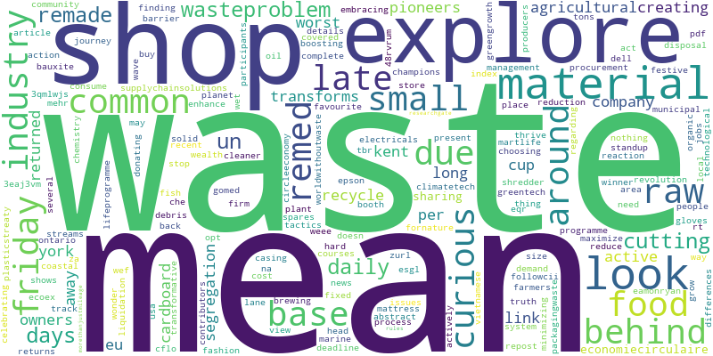

# Sentiment Analysis of Tweets 📊

This project analyzes Twitter data related to the **circular economy**, using **Natural Language Processing (NLP)** techniques to determine sentiment trends, engagement levels, and key discussion themes.

## 📌 Project Overview
- Scraped **5,000 tweets** related to the circular economy.
- Cleaned and preprocessed data by removing URLs, emojis, and irrelevant characters.
- Applied **Sentiment Analysis** to classify tweets as **Positive, Negative, or Neutral**.
- Divided tweets into four categories:
  - **Zone of Fading Out**
  - **Zone of Growth**
  - **Zone of Excellence**
  - **Zone of Viral Trends**
- Used **Word Clouds and Graphs** to visualize trends.
- Implemented a **Regression Model** for sentiment prediction.

## 📂 Tech Stack & Tools
- **Programming Language:** Python
- **Libraries:** Pandas, NLTK, Scikit-learn, Matplotlib, Seaborn
- **Machine Learning Model:** Regression Model for sentiment prediction
- **Data Visualization:** Word Clouds, Bar Graphs

## ⚙️ How It Works
1. **Data Collection** – Scraped **5000 tweets** using Twitter API.
2. **Preprocessing** – Cleaned text (removed stopwords, links, special characters).
3. **Sentiment Analysis** – Classified tweets as **Positive, Negative, or Neutral** using NLP techniques.
4. **Filtering & Grouping** – Divided tweets into 4 zones based on engagement and sentiment.
5. **Data Visualization** – Created word clouds and bar graphs to highlight trends.
6. **Prediction Model** – Used **Regression Analysis** to predict sentiment trends.

## 📊 Results & Insights
✅ Identified dominant emotions in circular economy discussions.
✅ Classified tweets into engagement-based zones for better trend analysis.
✅ Used **ML models** to predict sentiment shifts over time.

## 🚀 How to Run the Project
### 1. Clone the Repository
```bash
git clone https://github.com/yourusername/sentiment-analysis-tweets.git
cd sentiment-analysis-tweets
```
### 2. Install Dependencies
```bash
pip install -r requirements.txt
```
### 3. Run the Analysis Script
```bash
python Code.py
```
### 4. View Results
- Sentiment distribution graphs
- Word clouds for each sentiment group
- ML model predictions

## 📸 Sample Visuals
📌 **Positive Word Cloud**  
  

📌 **Negative Word Cloud**  
  

📌 **Sentiment Distribution Graph**  
  


## 📬 Contact
For any queries, feel free to reach out or open an issue! 😊
